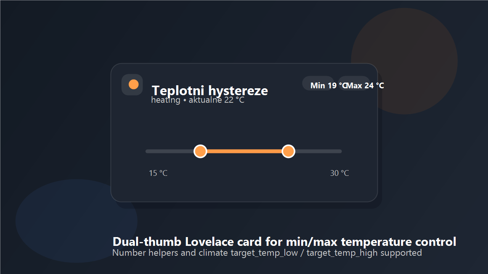

# Hyst Slider Card

Dual-thumb Lovelace karta pro Home Assistant, ktera na jedne ose nastavuje dve hodnoty: minimum a maximum teploty.



Pouziti:

- hysterese topeni nebo chlazeni
- nastavovani min/max teploty pres `input_number` nebo `number`
- ovladani `climate` entity s `target_temp_low` a `target_temp_high`

## Co umi

- dva palce na jedne ose: `Min` a `Max`
- Number rezim pro `input_number` a `number`
- Climate rezim pro `climate.set_temperature`
- Mushroom-like vzhled s ikonou, subtitle a zvyraznenym rozsahem
- obdelnikovy gradientni track (gauge-like, rovny)
- konfigurovatelny `step`, `decimals`, `accent_color`, `track_gradient`, `icon`, `subtitle`
- automaticke cteni `min`, `max`, `step` a jednotek z atributu entity

## Instalace pres HACS

1. V HACS otevri `Custom repositories`.
2. Pridej repozitar `https://github.com/Peta01/HystSlider`.
3. Typ nastav na `Dashboard`.
4. Nainstaluj `Hyst Slider Card`.
5. Restartuj Home Assistant.
6. Pokud se resource neprida automaticky, pridej:

```yaml
url: /hacsfiles/HystSlider/hyst-slider-card.js
type: module
```

Poznamka: cast `HystSlider` v URL musi odpovidat nazvu GitHub repozitare.

## Rychly start

### Varianta A: dve helper entity

```yaml
type: custom:hyst-slider-card
title: Teplotni hystereze
subtitle: Kotel - rozsah
subtitle_entity: sensor.kotel_power
subtitle_prefix: Vykon 
icon: mdi:radiator
min_entity: input_number.temp_min
max_entity: input_number.temp_max
min: 15
max: 30
step: 0.5
decimals: 0
unit: "°C"
min_label: Min
max_label: Max
accent_color: "#ce6b45"
track_gradient: "linear-gradient(to right, #00BCD4, #FF5722)"
```

### Varianta B: climate entita

```yaml
type: custom:hyst-slider-card
title: Klima loznice
icon: mdi:thermostat-box
climate_entity: climate.loznice
min: 17
max: 27
step: 0.5
decimals: 0
accent_color: "#f28b30"
```

V climate rezimu karta vola:

- service: `climate.set_temperature`
- data: `target_temp_low` a `target_temp_high`

## Konfigurace

- `type`: `custom:hyst-slider-card`
- `min_entity` + `max_entity`: povinne pro Number rezim
- `climate_entity`: povinne pro Climate rezim
- `title`: nadpis karty, default `Teplotni rozsah`
- `subtitle`: sekundarni text pod nadpisem
- `subtitle_entity`: entita, ze ktere se bere hodnota do subtitle
- `subtitle_attribute`: atribut z `subtitle_entity` (pokud nechces `state`)
- `subtitle_prefix`: text pred hodnotou subtitle
- `subtitle_suffix`: text za hodnotou subtitle
- `subtitle_unit`: vynucene jednotky pro subtitle (jinak se bere z entity)
- `icon`: MDI ikona vlevo v headeru
- `min_label`: popisek leve hodnoty, default `Min`
- `max_label`: popisek prave hodnoty, default `Max`
- `min`: minimum slideru
- `max`: maximum slideru
- `step`: krok slideru
- `decimals`: pocet desetinnych mist pro zobrazeni, default `0`
- `unit`: jednotka, default z entity nebo `°C`
- `accent_color`: barva aktivni casti slideru
- `track_gradient`: vlastni CSS gradient pro obdelnikovy track
- `set_service`: vlastni service ve formatu `domain.service` pro Number rezim

## Doporuceny setup helperu

Pro jednoduchy start si vytvor dva helpery typu Number:

- `input_number.temp_min`
- `input_number.temp_max`

Pak je pripoj do karty jako `min_entity` a `max_entity`.

## Poznamky

- `decimals` ovlivnuje zobrazeni, ne vnitrni hodnotu odesilanou do Home Assistant.
- Pokud se karta po instalaci nezobrazi, udelej hard refresh prohlizece a zkontroluj resource URL.
- Pro HACS update workflow pouzivej posledni release tag.

## Repo

- GitHub: `https://github.com/Peta01/HystSlider`
- Release: `https://github.com/Peta01/HystSlider/releases/latest`